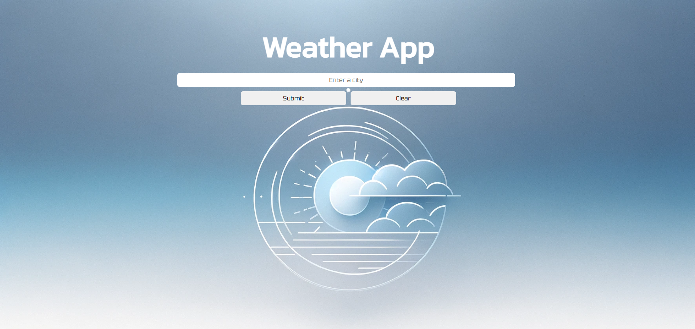
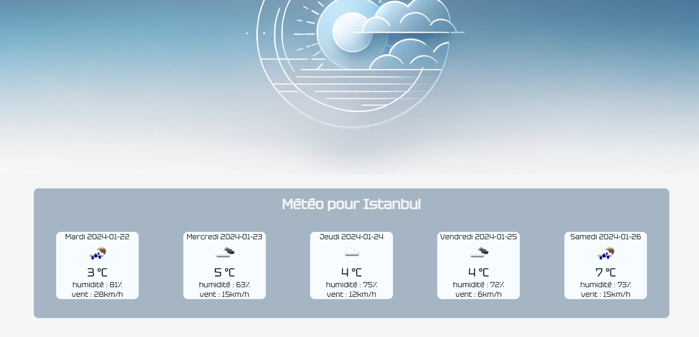

# Weather App 🌤️
Weather App est  conçue  pour  ceux  qui veulent connaître  les  conditions météorologiques à  tout  moment, que  ce  soit  dans  leur  ville natale ou  dans une ville  à l'autre bout  du  monde.

## Utilisation
Entrez simplement le nom de la ville et notre application vous fournira les prévisions météorologiques pour les 5 prochains jours.

## Technologies utilisées
-   HTML
-   SCSS
-   JavaScript
## Remerciements
-   [OpenWeather](https://openweathermap.org/)
-   Toute personne qui a contribué au code ou aux idées

## Licence
Ce projet est sous licence [BeCode].

## Contact
Ugur Firat - Ugur.firat240@gmail.com

Lien du projet - https://ugur-f.github.io/WeatherApp/

## Screenshot

N'hésitez pas à contribuer ou à signaler des problèmes!

